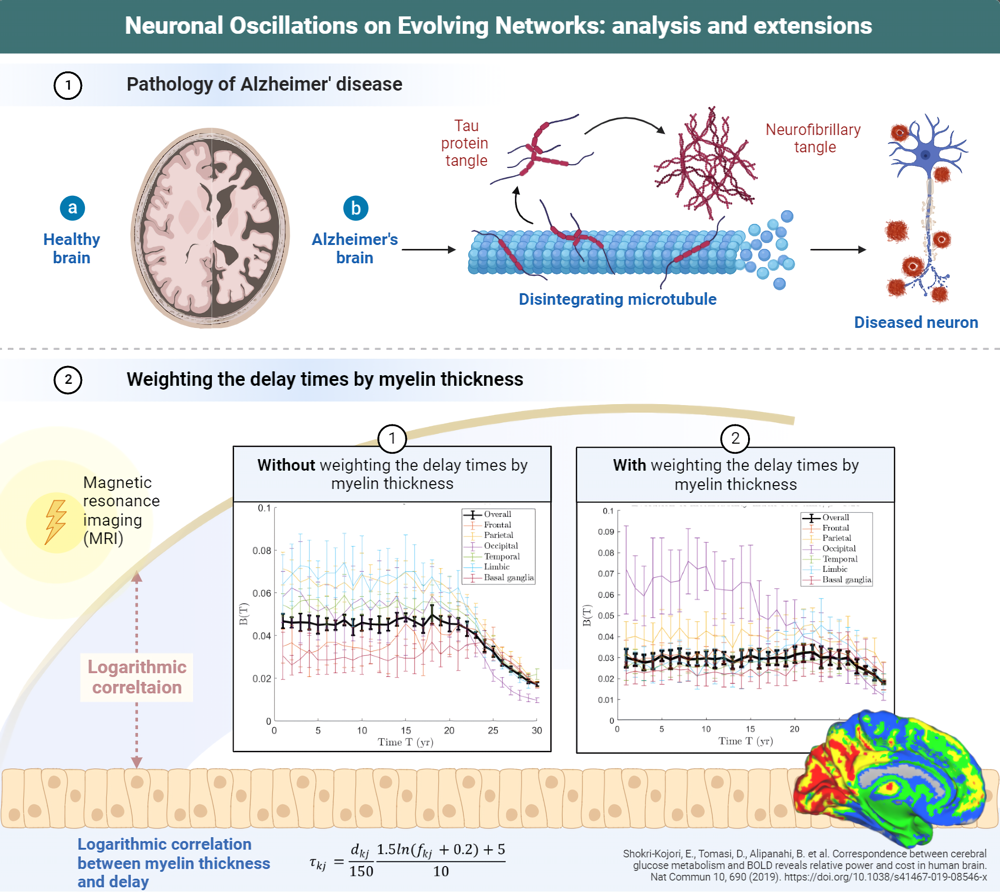

## **Neuronal Oscillations on Evolving Networks**

In this project, I and my colleagues modelled the progression of Alzheimer's disease. This work extends previous attempts to model the underlying biological processes of the disease, including the aggregation and cascade of toxic proteins and their impact across the brain connectome. We expand prior research showing other implications of long-term disease progression on the connectome, by modelling the topological evolution of the network and its relationship with cognition, as well as the role of myelin thickness and the effect of increased signal delays on cognitive deterioration.

In addition to being part of writing the code to reproduce the results of the original paper, I have added a new wall approach that takes into account the rate of information and nutrient transport as a function of the thickness of the neuron's myelin layer. Thanks to this approach, the relative extent of damage to each brain area was consistent with that observed in real patients in the medical researches.

The original paper from Alain Goriely et.al.(2020) can be read **[HERE](https://journals.aps.org/prl/abstract/10.1103/PhysRevLett.125.128102)**
 
The article describing the project can be read **[HERE](https://github.com/nyirobalazs/neuronal-oscillations-on-evolving-networks/blob/main/PBM_Report_Paper_Evolving_Networks%20(3).pdf)**

*The second graph in the lower figure clearly shows that the metabolic index of the occipital cortex decreases most markedly during the simulation after taking myelin thickness into account, which is consistent with the heatmap of the destruction based on medical research:*

